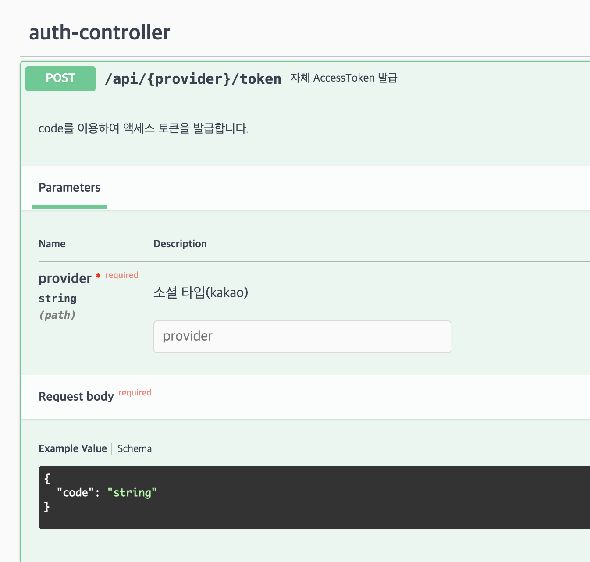

# 카카오 소셜로그인 방법

로그인만을 원하기때문에, OIDC 방식을 사용합니다.

추후 배포 후 스웨거를 보면



해당 API가 있습니다.

provider에 kakao를 입력하고, body값에 code를 입력하시면 됩니다.

이 부분은 제가 리액트 + 자스로 코드를 구현해 둔게 있어서 아래에 공유합니다. 참고하셔요!

```jsx
import { useState, useEffect } from "react";
import axios from "axios";
import { useNavigate } from "react-router-dom";

export default function BaseLogin() {
  const [code, setCode] = useState(null);
  const [idToken, setIdToken] = useState(null);
  const navigate = useNavigate();

  useEffect(() => {
    const urlParams = new URLSearchParams(window.location.search);
    const code = urlParams.get("code");
    const provider = localStorage.getItem("provider");

    if (code) {
      setCode(code);
      getToken(code, provider);
    }
  }, [navigate]);

  const kakaoHandleLogin = () => {
    localStorage.setItem("provider", "kakao");
    window.location.href =
      "https://kauth.kakao.com/oauth/authorize?response_type=code&client_id=c88d155ce18616f58d5b8694aafec094&redirect_uri=http://localhost:3000/login";
  };

  const getToken = async (authCode, provider) => {
    try {
      const tokenResponse = await axios.post(
        `http://localhost:8080/api/${provider}/token`,
        {
          code: authCode,
        }
      );

      console.log(tokenResponse);
      navigate("/home");
    } catch (error) {
      console.error("Error fetching token:", error);
    }
  };

  return (
    <>
      <button onClick={kakaoHandleLogin}>카카오 로그인</button>
    </>
  );
}

```

client_id: `c88d155ce18616f58d5b8694aafec094` 입니다.

redirect_uri 는 배포후 프론트 주소에 맞게 리다이렉트 될 주소입니다. 추후 수정하면됩니다. (프,백 모두 수정해야함) → 아마 [www.mood9.shop](http://www.mood9.shop) 일 듯함 → 이는 버셀에서 cname설정할때 value 값을 백엔드 도메인에 cname의 value 값으로 설정해줘야함.

---

백엔드 API와 프론트 코드를 사용하여 api 통신을 하게되면, 아래와 같이 accesstoken이 발급됩니다.


이를 아래와 같이 header에 담아 백엔드 서버와 통신을 하면됩니다.


헤더에 토큰이 담겨있지 않으면 서버와 통신은 불가능합니다.

토큰의 만료 시간은 24시간입니다. 24시간 이후에는 재로그인 해야합니다. 서비스 특성상 24시간이 넘어갈 것 같지 않아서 이와 같이 설정했습니다.

---

스웨거에서는


이와 같이 입력하고 Authorize를 누르시고 api 호출하시면 됩니다.